# 兴信B ERP 网页版 · 操作手册（完整业务流程）

兴信B ERP 网页版是一套服装、塑胶一体化生产管理系统。本手册按真实业务闭环编排，从基础资料一路讲到采购、领料、塑胶、外发装配、盘点月结，适合一线操作员按章跟做。

- **访问地址**：浏览器（推荐 Chrome）打开 `http://localhost:5173`，账号由管理员分配（如 `admin`）。
- **核心规则（务必先记住）**：**保存 ≠ 生效**。单据点「保存」只是存起来；**点「审核」之后才会真正扣库存、进报表**。审核后要改，先点「反审核」解锁，改完重新保存、审核。

---

## 第 0 章 总览：一页看懂全流程

**服装主线（物料仓）**：

```
基础资料（供应商/客户/款号/物料/仓库/部门）
  └─ BOM物料设置（保存 → 审核）
       └─ 生产通知单（保存 → 审核，货号行勾选“分析”）
            └─ 采购物料分析（按生产单看缺料）
                 └─ BOM订单制作（勾选缺料行 → 生成采购订单）
                      └─ 采购订单（保存 → 审核）
                           └─ 采购入仓单（选订单带入 → 保存 → 审核）★库存增加
                                └─ 领料单（带生产单号 → 保存 → 审核）★库存减少
                                     └─ 车间生产 / 外发加工
                                          └─ 半成品入仓 → 成品入仓
                                               └─ 库存盘点（审核回写库存）→ 库存月结
```

**塑胶线（塑胶仓）**：

```
工模表 + 啤机机型啤工表
  └─ 塑胶共用物料表（选模带字段，套数=出模数÷用量 校验）
       └─ 塑胶采购分析 → 塑胶订单制作 → 塑胶采购订单（审核）
            └─ 塑胶入仓单（审核）→ 塑胶领料/退料 → 塑胶盘点
                 └─ 二次加工：塑胶加工采购单（按 加工内容+次序 拆两次工序）
```

**外发装配线**：

```
装配物料设置（类别决定成品仓/半成品仓，审核）
  └─ 装配加工采购单（保存时快照 BOM 辅料，审核）
       └─ 加工厂分类明细表（按加工厂查往来）
```

三条线共用同一套基础资料和「保存 → 审核」规则，后面各章逐一展开。

---

## 第 1 章 基础资料准备

目的：资料先行。供应商、客户、款号、物料、仓库、工模、部门是所有单据的下拉来源，做业务前务必先维护好。

### 1.1 供应商资料

1. 点击左侧菜单「基本设置 → 供应商资料」。
2. 点右上角「新增」，在弹窗中填编号、名称、类别、联系人、手机、货币、备注，点「确定」。
3. **类别**用来区分供应商类型：普通材料商直接填类别名（如 DEMO）；**本厂自己的加工部门填「内部厂」**（如 DEMO-SUP-INT 演示内部厂），发外加工结算时会用到。

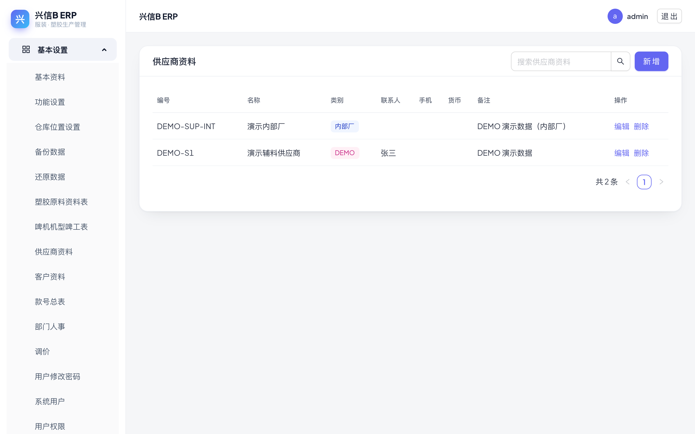

### 1.2 客户资料

1. 点击「基本设置 → 客户资料」。
2. 点「新增」填客户编号、名称、类别、联系人、付款方式等，点「确定」。
3. 客户是 BOM、生产通知单的必选字段，务必先建。

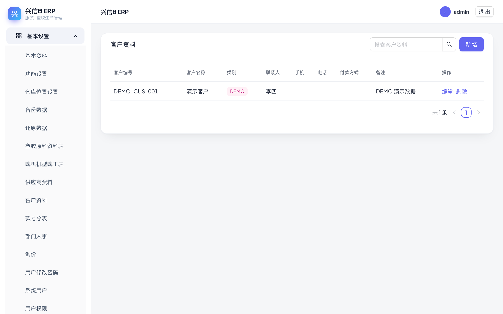

### 1.3 款号总表

1. 点击「基本设置 → 款号总表」。
2. 点「新增」填款号、款式及单价、成本价、批发价、零售价。
3. **出厂价 / 装彩盒单价会被装配物料设置的“库存单价HK”自动计算引用**（见第 7 章），建议填全。

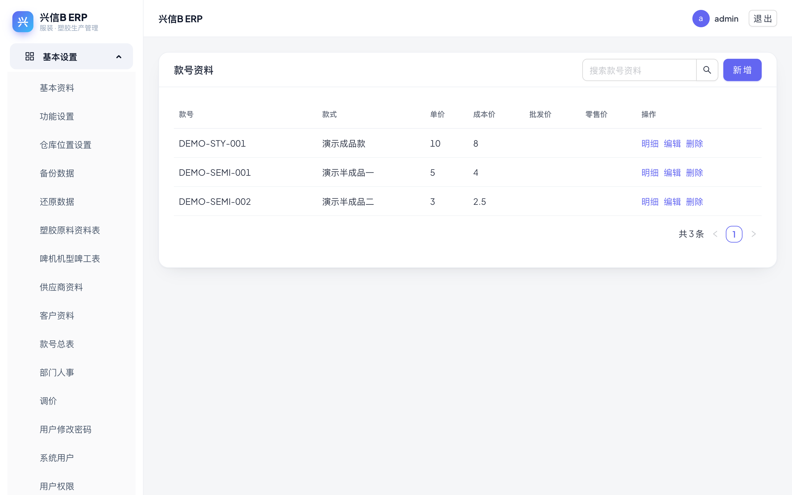

### 1.4 物料类别树与物料资料

1. 点击「仓库管理 → 物料资料」。
2. 左侧类别树：选中类别后点「新增同级类别」「新增子类别」维护分类；点类别节点右侧列表即按类过滤。
3. 点「+ 新增」建物料：**物料编号留空，保存时按类别自动生成**，也可手工改；供应商一并填好，生成采购订单时会自动带出。


### 1.5 仓库位置设置

1. 点击「基本设置 → 仓库位置设置」。
2. 点「新增」填编号（如 A仓 / A-01）、名称、备注。
3. 单据上的「仓库」栏（如 DEMO-WH）即来自此处。

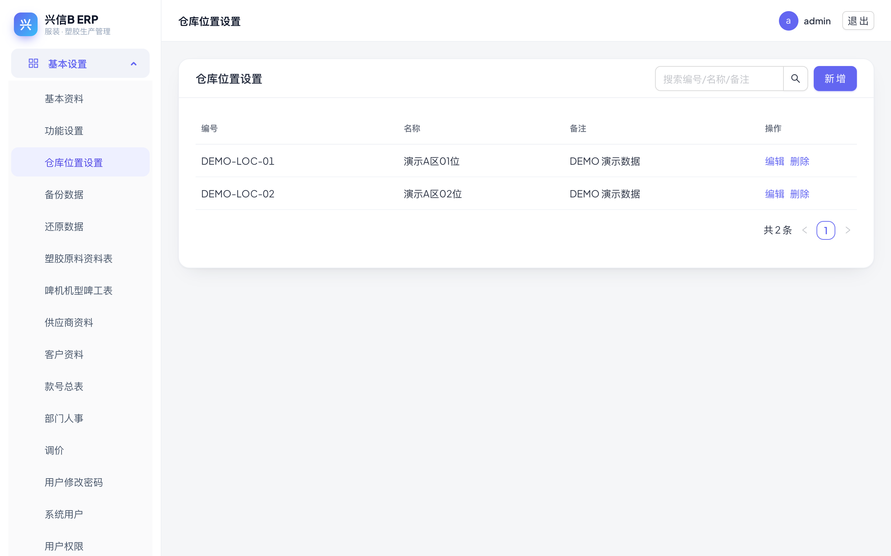

### 1.6 工模表与啤机机型字典

1. 点击「塑胶仓库 → 工模表」，点「新增」。
2. 填工模编号（自动转大写）、名称、颜色（格式：颜色/PANTONE，如 绿色/7481C）、整啤模腔数、水口比例、毛重净重等。
3. **「啤机机型」是下拉框，选项来自「基本设置 → 啤机机型啤工表」字典**；选中机型后若啤机价钱为空会自动带出该机型的啤工价。机型有新增时先去啤机机型啤工表补字典。

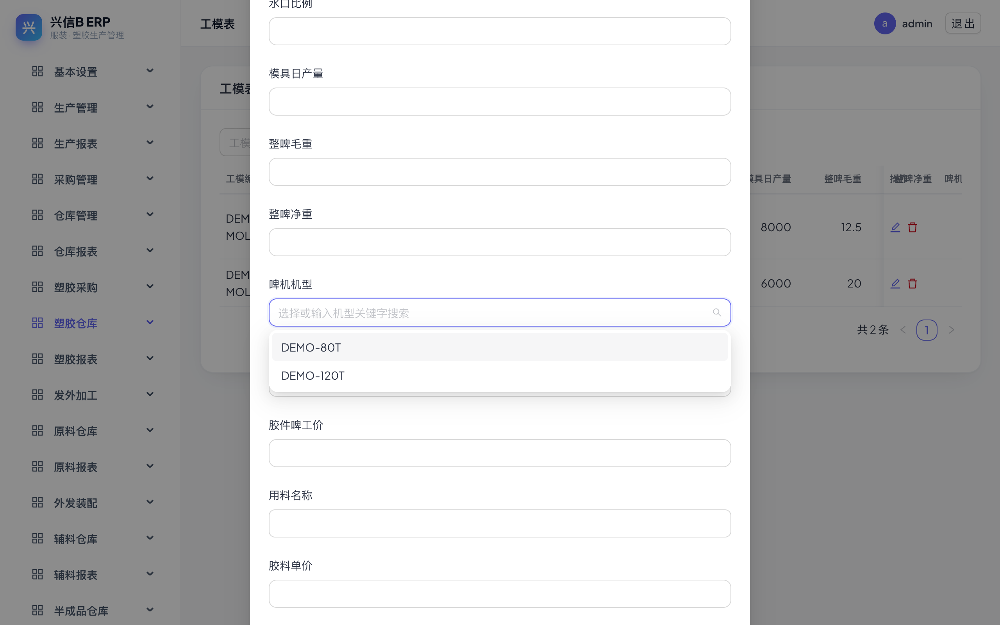

### 1.7 部门人事

1. 点击「基本设置 → 部门人事」维护部门（如演示装配部）。
2. 领料单的「部门」、领料人「选人」都来自这里。

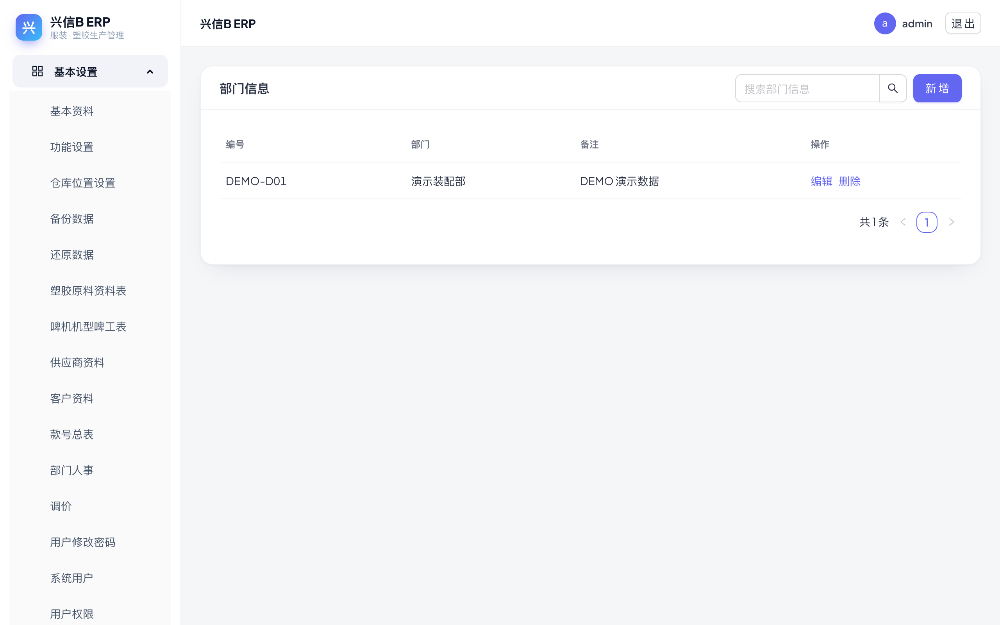

**注意点**：以上资料被单据引用后不要随意删除；要停用请改名备注，避免旧单据查不到名字。

---

## 第 2 章 BOM 物料设置

目的：BOM 定义一个货号由哪些物料、半成品组成及用量，是采购分析和领料的计算基础。以 DEMO-STY-001 为例。

1. 点击「生产管理 → BOM物料设置」，点工具栏「打开」，在弹窗点选货号载入。
2. 表头字段说明：
   - **客户 / 产品货号**：必填，BOM 挂在「客户 + 货号」上；
   - **装配方式 / 类别**：装配货号用（见第 7 章），普通 BOM 可留空；
   - **其他成本(HK$)**：该货号的额外成本，随报价汇总；
   - **半成品计算库存**：勾选后采购分析时半成品先扣库存再算缺料；
   - **库存单价HK$**：留空保存时自动计算——**优先取款号总表的出厂价（类别=成品）或装彩盒单价（半成品类），都没有则按 BOM 物料合计（用量 × 物料单价）**；手工填过的值不会被覆盖。
3. 明细网格每行一种物料：点「物料名称」格弹窗选料（两个页签：物料 / 半成品）。**右侧报价表**记录合作方报价：类型选「供应商 / 加工厂」的行必须选合作方；**类型=「本厂」的行不能选合作方**（输入框自动禁用），且每个款号最多一行本厂报价。
4. 点「保存」落库；**已审核的 BOM 全页锁定，须先点「反审核」才能改**。

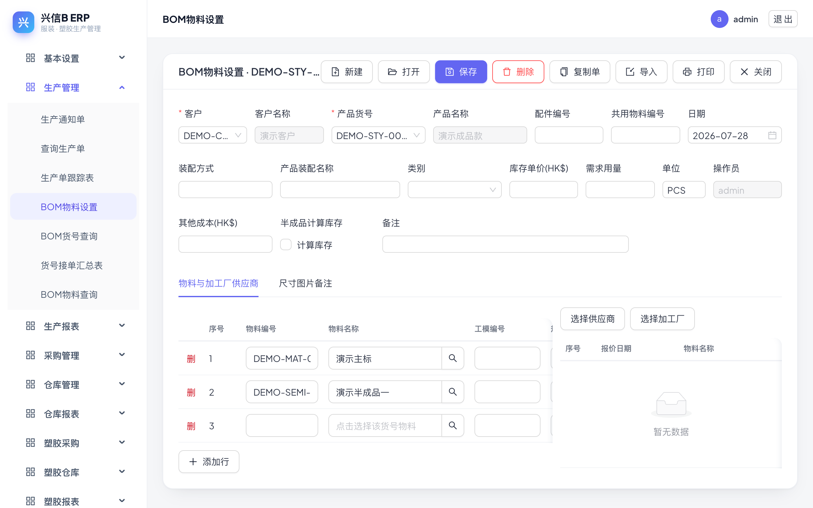

### 复制单

点工具栏「复制单」，选择目标产品货号，点「复制」，即把当前 BOM 整套复制到新货号下，适合相似款快速建 BOM。

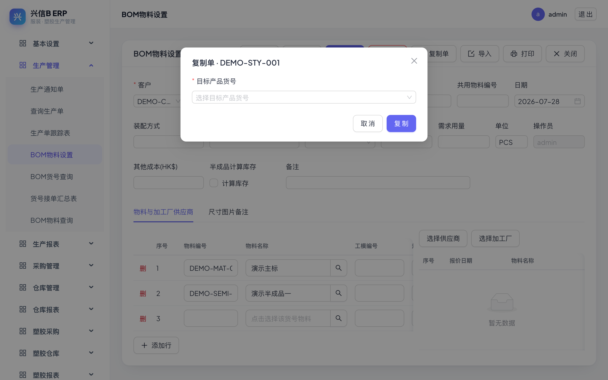

### 多层级半成品（重要）

成品 BOM 里如果用了半成品（如 DEMO-SEMI-001），**必须把该行选成“半成品”**（点物料名称格，在「半成品」页签里选），系统才会继续向下展开半成品的物料。若把半成品当成普通物料直接录入，保存时系统会弹出「已保存，但存在重复扣料风险」警告——因为半成品本身的物料还会再次出库，造成重复扣料。

### 表格导入

明细多时可从 Excel 批量导入（先「打开」货号，否则「导入」按钮灰色）：

1. 点工具栏「导入」，弹出导入窗口，两种方式：**粘贴 Excel 内容**（复制后直接粘贴，点「解析」）或**上传 CSV 文件**（xlsx 请先在 Excel「另存为 CSV」，支持 UTF-8 / GBK）。
2. **列规则**：有表头按列名——「物料编号」必填（兼容：编号 / 料号 / 物料），「使用数量」（兼容：用量 / 数量）；无表头按位置——第 1 列 = 物料编号、第 2 列 = 使用数量。
3. 解析后逐行对照物料档案校验：有效行标绿，无效行标红并注明原因，导入时自动跳过。
4. 选「追加到现有明细」或「替换全部明细」，点「确定导入」填入网格；**最后仍须点「保存」才落库**。
5. 注意：**半成品款号若没在物料档案建档，同样会被判“物料不存在”而跳过**，需先到物料资料补建。


---

## 第 3 章 生产通知单

目的：生产通知单是生产的起点，审核后它的 BOM 物料需求才进入采购分析和领料统计。

1. 点击「生产管理 → 生产通知单」，页面即是新建表单（生产单号保存后自动生成）。
2. 填单头：订单类型（正式单/样品单/返单）、客户编号、交货日期、合同号等。
3. 点「添加货号」加货号行：填货号、选 BOM 款号（必填）；**「分析」列打勾**——勾选后该货号才参与采购物料分析。
4. 在下方「制单内容」页签为每个货号录入颜色 × 尺码数量（每个货号至少一行数量大于 0，否则不能保存）。
5. 点「保存」，提示创建成功并自动载入该单；核对无误点工具栏「审核」（无确认框，点即审）。
6. 审核后：「保存」「删除」变灰，只剩「反审核」；查看态可切到「物料清单」页签看 BOM 展开的总数量 / 库存数量 / 需订数量。

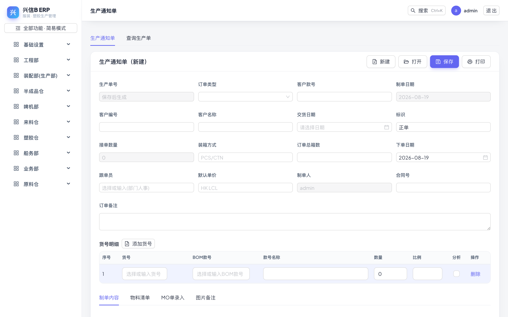

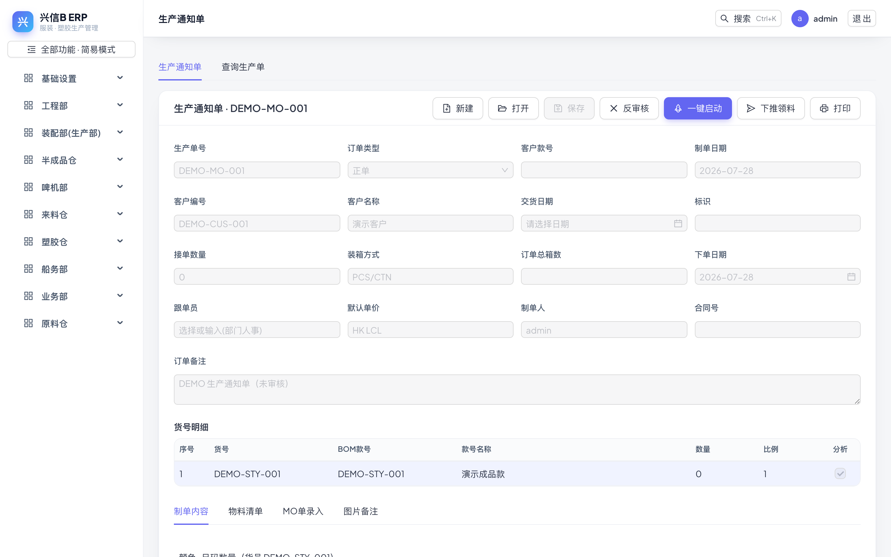

**注意点**：要查历史单据点工具栏「打开」弹窗搜索；审核后想改单，先「反审核」，改完重新保存并审核。

---

## 第 4 章 采购与入库

目的：把生产单的缺料变成采购订单，收货入仓后库存增加，全程可追踪。

### 4.1 采购物料分析

1. 点击「采购管理 → 采购物料分析」，列表显示已审核的生产单（可按单号/款号/客户搜索）。
2. 点某一生产单行，可直接进入该单的采购订单新建抽屉（按 BOM 预填）。

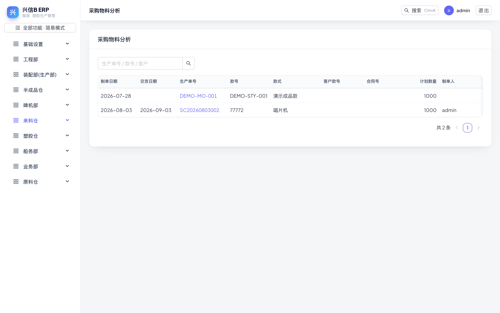

### 4.2 BOM订单制作 → 生成采购订单

1. 点击「采购管理 → BOM订单制作」，列表按 生产单 × 物料 列出需订行。
2. **勾选**要采购的行（可多选），点「生成采购订单」。
3. 确认窗口提示生成几张订单（按 **生产单 × 供应商** 分组：同生产单同供应商合并一张），点「生成」。
4. **缺供应商编号的行会被跳过并提示**；物料主档填了供应商的会自动带出。

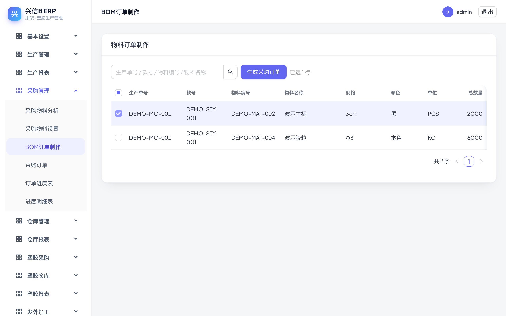

### 4.3 采购订单审核

1. 点击「采购管理 → 采购订单」，可按 单号/供应商/生产单号 搜索（如 DEMO-MO-001）。
2. 点单号行打开抽屉核对明细（数量、单价、金额），点抽屉右上角「审核」（点即审，无确认框）。
3. 已审核显示绿色标签，按钮变「反审核」。**采购订单必须审核，入仓单才能选到它的欠数行。**

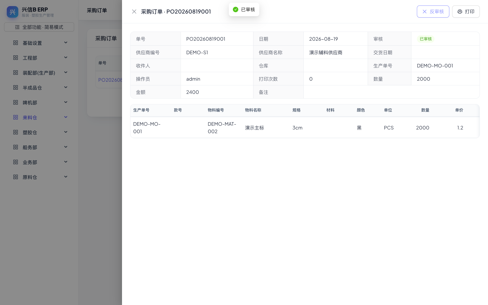

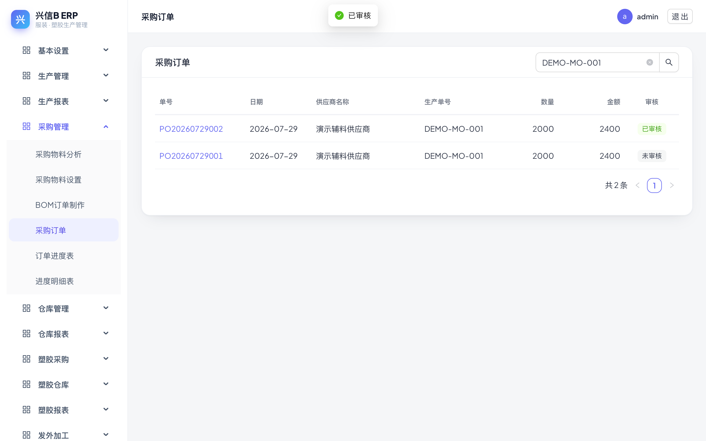

### 4.4 采购入仓单

1. 点击「仓库管理 → 采购入仓单」，点「新建采购入仓单」。
2. 填供应商编号、仓库（必填）。
3. 明细行点「选订单」，弹窗**只列已审核且还有欠数的订单行**（按单头供应商过滤）；点一行即整行带入，数量自动 = 欠数，可手改。
4. 点抽屉右上「保存」；回到列表，在该行「操作」列点「审核」。**审核后库存增加。**

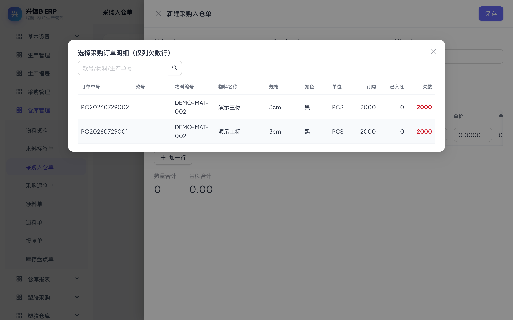

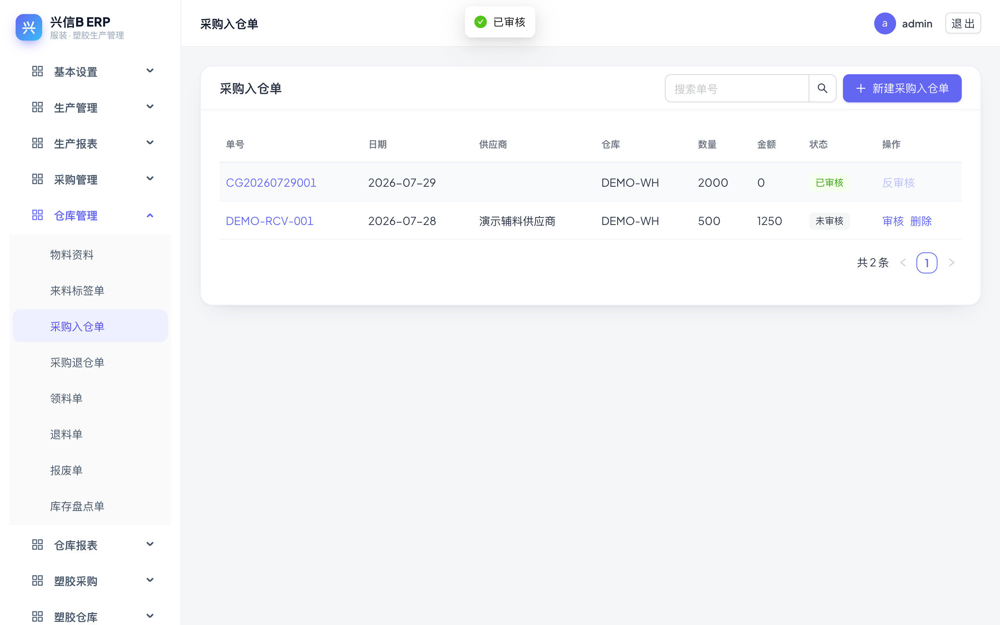

### 4.5 库存统计表看变化

1. 点击「仓库报表 → 库存统计表」，可按物料编号/名称或仓库过滤。
2. 入仓审核后对应物料库存数量即时增加（负库存红色显示）。

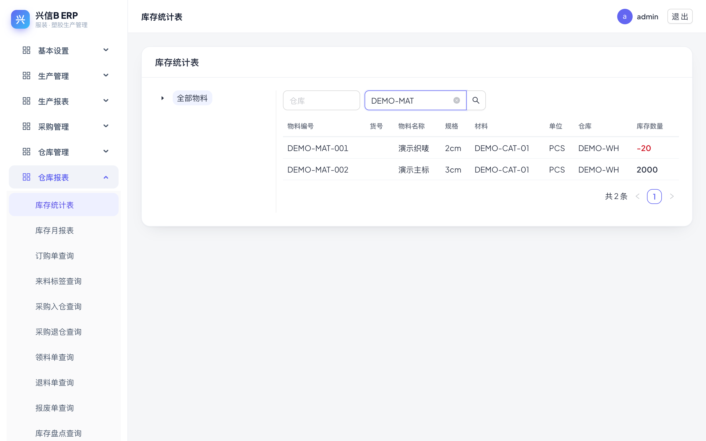

---

## 第 5 章 车间领料

目的：车间按生产单领料出库，领料数量回写到“计划 vs 实际”统计，便于控制超领。

1. 点击「仓库管理 → 领料单」，点「新建领料单」。
2. 填部门、仓库（必填）；领料人点 🔍 从人事档案选人。
3. 明细行：点「生产单号」格的 🔍，在弹窗（仅列已审核生产单）选生产单，款号自动带出；再点「物料编号」格的 🔍 选物料，填数量。
4. **务必带生产单号**：不填生产单号的领料，「制单用量查询」「领料超数查询」统计不到，计划与实际对不上。
5. 点抽屉右上「保存」，回列表点该行「审核」。**审核后库存减少。**

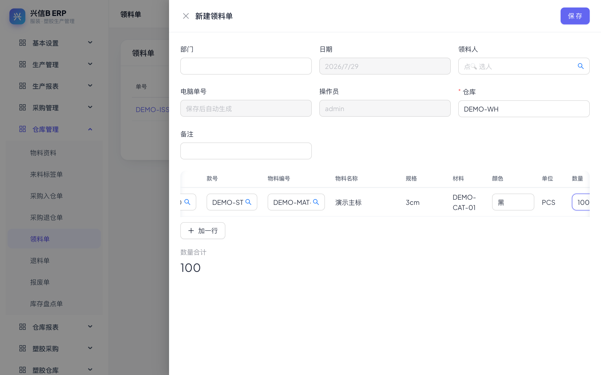

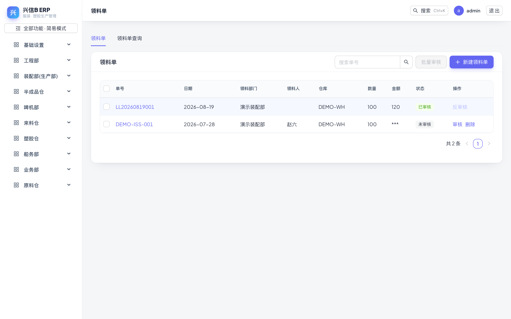

### 制单用量查询（计划 vs 实际）

点击「生产报表 → 制单用量查询」，左侧点选生产单，右侧显示每种物料的**计划用量、实际领料、差异（=实际−计划：负=欠领，正=超领）**。

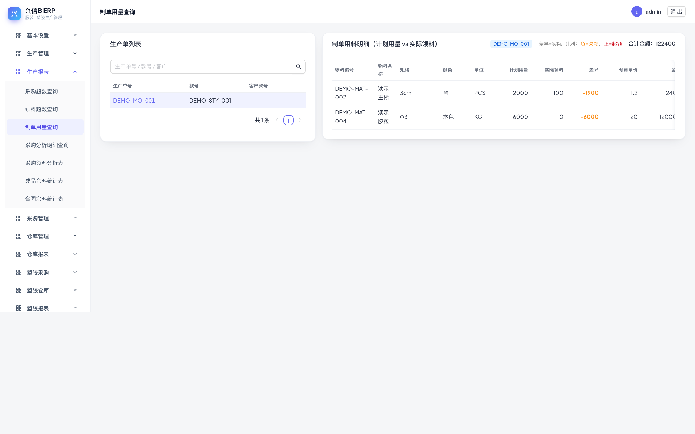

### 领料超数查询

点击「生产报表 → 领料超数查询」，按生产单/物料搜索；**差异=已领−需求：负数橙色=欠领，正数红色=超领**。

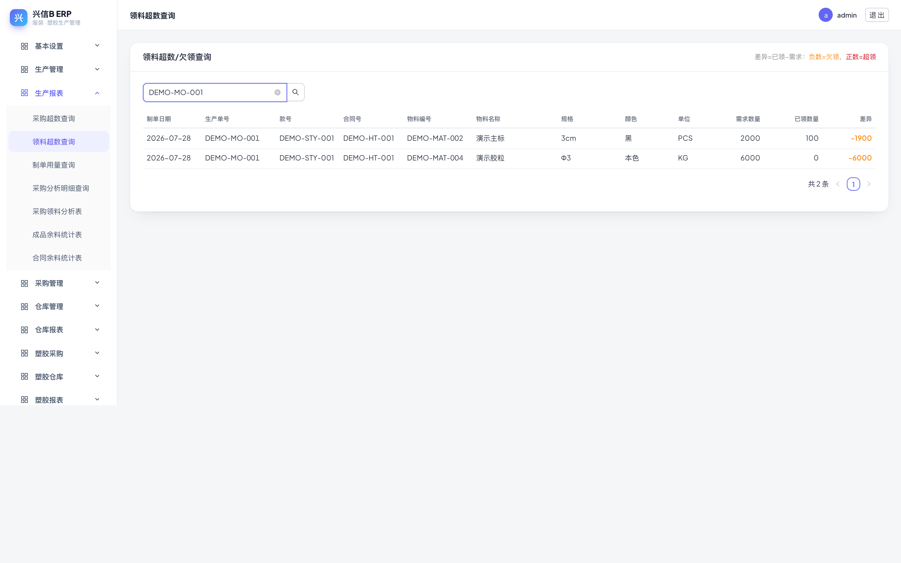

---

## 第 6 章 塑胶流程

目的：塑胶件从工模、共用物料、采购、入仓到盘点的专用流程，与物料仓类似但多了工模与二次加工概念。

### 6.1 工模表

先做 1.6 节的工模档案（塑胶仓库 → 工模表），啤机机型来自字典联动。

### 6.2 塑胶共用物料表（含四量校验）

1. 点击「塑胶仓库 → 塑胶共用物料表」，点「新增」。
2. 填塑胶货号（必填）；点工模编号旁的「选模」，在弹窗点选工模（如 DEMO-MOLD-01），**颜色、色粉号、用料、模腔数、毛净重、机型、价格等自动从工模表带回**；物料编号点「选料」带回名称颜色。
3. **四量关系校验：套数 必须等于 出模数 ÷ 用量**，输入时即时红字提示，不等就不让保存。例如出模数 8、用量 2，套数必须是 4；输成 3 会报错「套数必须等于 出模数 ÷ 用量」，改正后才能保存。

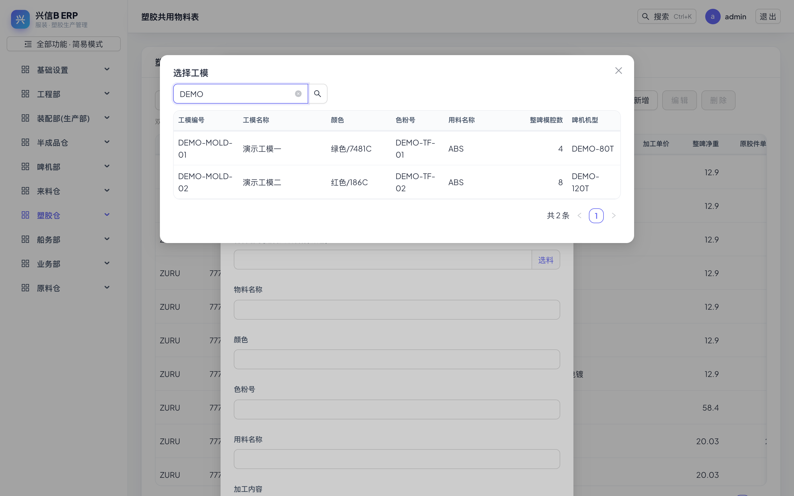

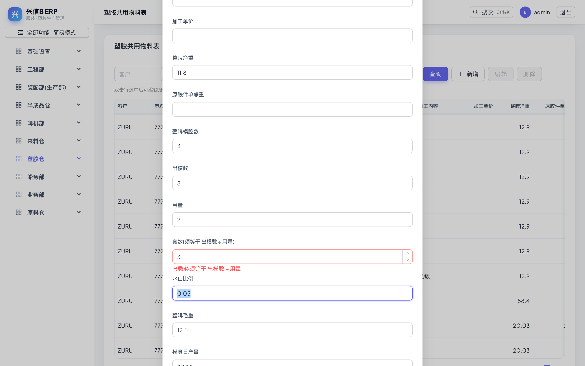

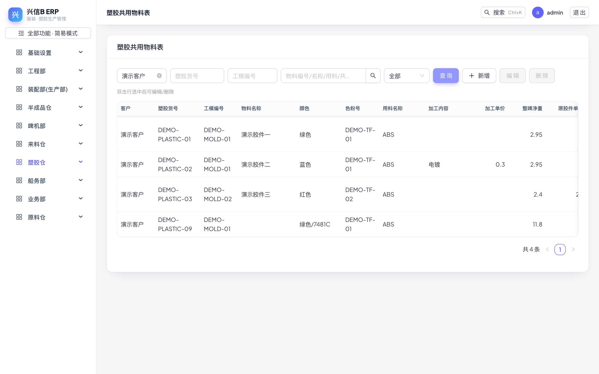

### 6.3 二次加工与塑胶加工采购单

同一胶件要做两道工序（如先电镀再印喷）时，用「发外加工 → 塑胶加工采购单」：

- 明细的「加工内容」是第一次工序，「加工次序」选第一次/第二次，「加工字母」填工序字母代码；
- 点「调入加工清单」选生产单，若 BOM 行含二次加工组合，会**自动拆成两条明细**（第一次、第二次各一条）。

**加工类别字母对照表**：

| 类别 | 第一次 + 第二次工序 |
|---|---|
| BD | 电镀（B）+ 印喷（D） |
| AF | 印喷（A）+ 植绒（F） |
| AH | 印喷（A）+ 植发（H） |

（“喷油”视同“印喷”；两工序顺序不限，组合相同即归同类。）

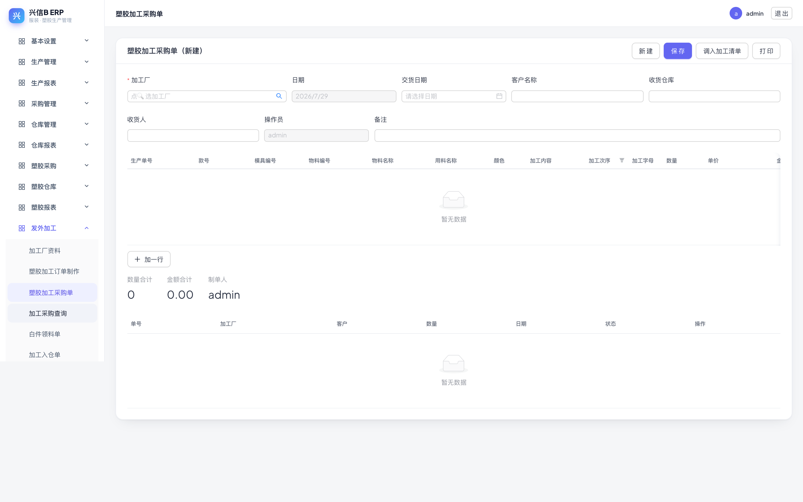

### 6.4 塑胶采购订单

1. 点击「塑胶采购 → 塑胶采购订单」。
2. 选供应商（必填），点「调入清单」选生产单把 BOM 明细（含用量、套数、色粉号）带入，填数量后「保存」。
3. 右侧「物料清单(合并)」按物料编号自动汇总；审核/反审核在下方历史列表的「操作」列。

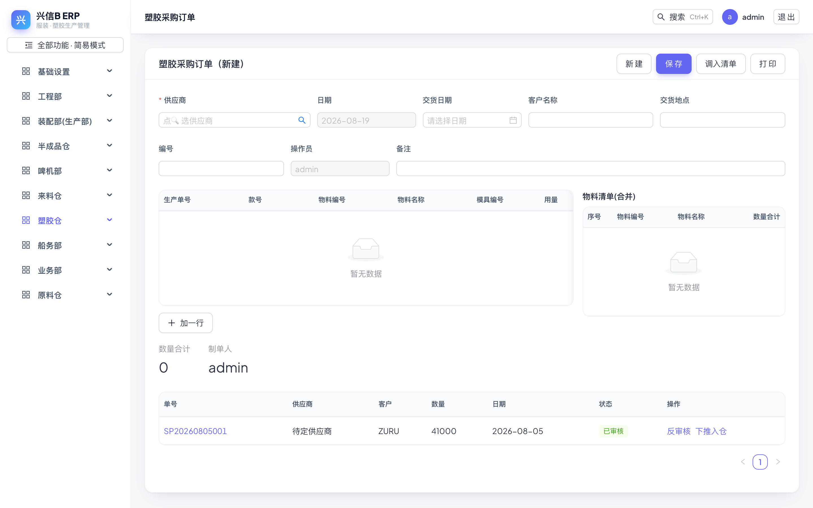

### 6.5 塑胶入仓单

1. 点击「塑胶仓库 → 塑胶入仓单」。
2. 选供应商、填仓库（必填），明细行选物料（带回名称/规格/单位/仓位号），填数量、单价，点「保存」。
3. 审核同样在下方历史列表「操作」列。

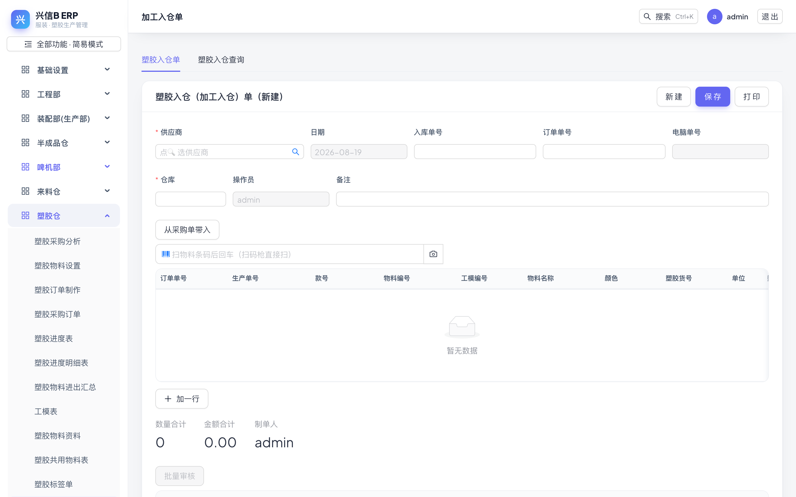

### 6.6 塑胶盘点

1. 点击「塑胶仓库 → 塑胶盘点单」。
2. 右上角填仓库，点「带出库存」，系统按账面列出每种胶件（系统数量、盘点数量默认相等、盈亏自动算）。
3. 改实盘数后点「提交盘点」，历史列表里点「审核」生效。

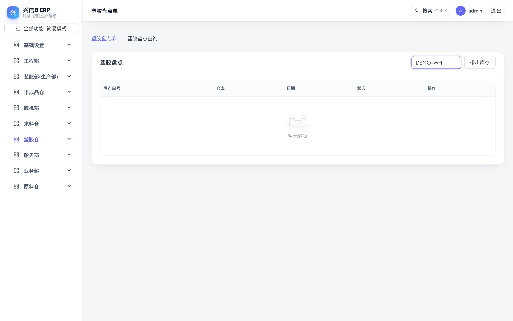

**注意点**：「带出库存」只对账上有库存的仓库有效，空仓库会提示无库存可盘点。

---

## 第 7 章 外发装配

目的：装配款发外加工时，用装配物料设置定义用料与报价，用装配加工采购单下单给加工厂。

### 7.1 装配物料设置

1. 点击「外发装配 → 装配物料设置」，「打开」装配款号（如 DEMO-STY-001）。
2. 关键字段：
   - **类别**：三个选项——未包装半成品 / 半成品 / 成品。**选「成品」的款号只能进成品入仓单；选半成品类的进半成品仓**；未设置类别的款号两边都能选，务必设对，否则入错仓。
   - **库存单价(HK$)**：留空保存时自动计算（规则同第 2 章：出厂价/装彩盒单价优先，否则 BOM 物料合计），手填不覆盖。
   - 报价表：**本厂行不能选合作方**（每款号至多一行本厂报价），供应商/加工厂行必须选合作方。
3. 保存后点「审核」锁定；改动先「反审核」。

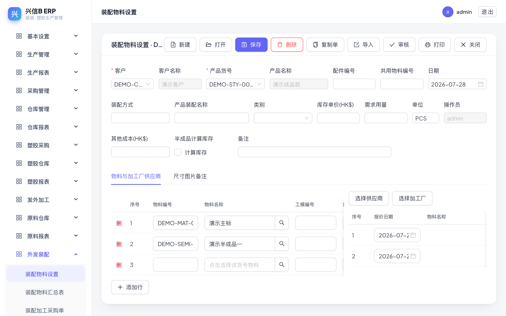

### 7.2 装配加工采购单（快照机制）

1. 点击「外发装配 → 装配加工采购单」，「打开」可查历史单（如 DEMO-ZP-001）。
2. **快照**：保存时把当时 BOM 展开的辅料明细原样存进单据；**之后再改 BOM，不影响已保存的单据**，只对新开的单生效。要按新 BOM 重算，点工具栏「辅料表」手动重建。
3. 审核/反审核在工具栏（点即审）；「前单/后单」翻历史单。

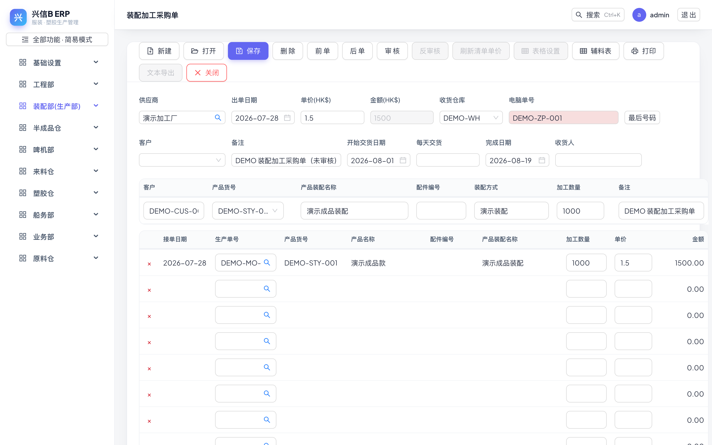

### 7.3 加工厂分类明细表

点击「外发装配 → 加工厂分类明细表」，按类别/加工厂/日期/单号查询与各加工厂的往来单据（含数量、金额、审核状态），底部自动合计。

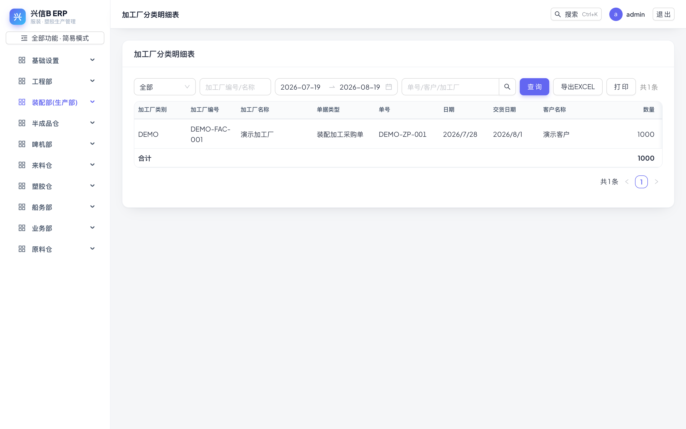

---

## 第 8 章 盘点与月结

目的：定期把账面库存校准为实盘库存，月末用月结锁定当期数据出月报。

### 8.1 库存盘点单（全仓底稿式）

1. 点击「仓库管理 → 库存盘点单」。
2. 顶部填仓库，点「带出库存」——**该仓全部物料按账面列出底稿**（系统数量、盘点数量默认相等、盈亏自动算），逐行改实盘数。
3. 点「提交盘点」生成盘点单（单号 PD 开头）；在下方列表点「审核」。
4. **审核才生效**：审核时按盘点数量回写物料主档库存、盈亏进库存统计；反审核可按原系统数量还原。

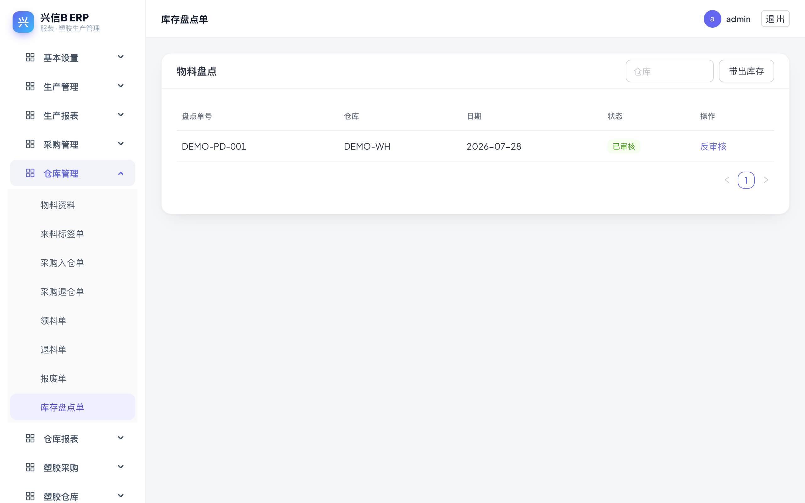

### 8.2 盘点查询

点击「仓库报表 → 库存盘点查询」，可按月份/审核情况/类别/单号查明细（系统数量、盘点数量、盈亏数量），「汇总查询」页签按物料汇总；双击明细行单号可看整张盘点单。

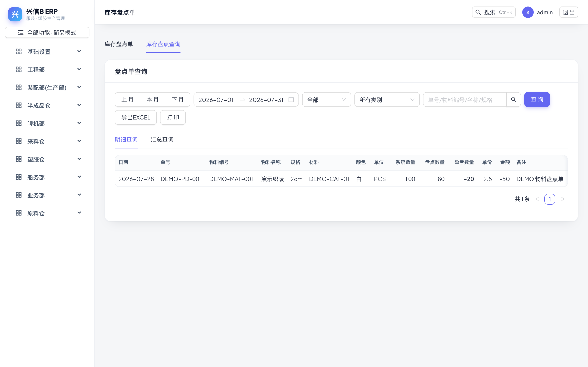

### 8.3 库存月结 / 月报表

1. 点击「仓库报表 → 库存月报表」。
2. 选口径（成品/半成品/物料）、月份、仓库（空=全部），表格即显示 期初 / 本期入 / 本期出 / 结存。
3. 点「执行月结」，弹出确认气泡（如“确认月结 202607 成品？”），点「确定」才把当期结存写进快照；已结月份显示在表格上方。
4. 月结是“软结账”：只写快照不锁单据；同月同口径重复月结会被拒绝，需先「反月结」（存在更晚月份快照时不能反月结）。

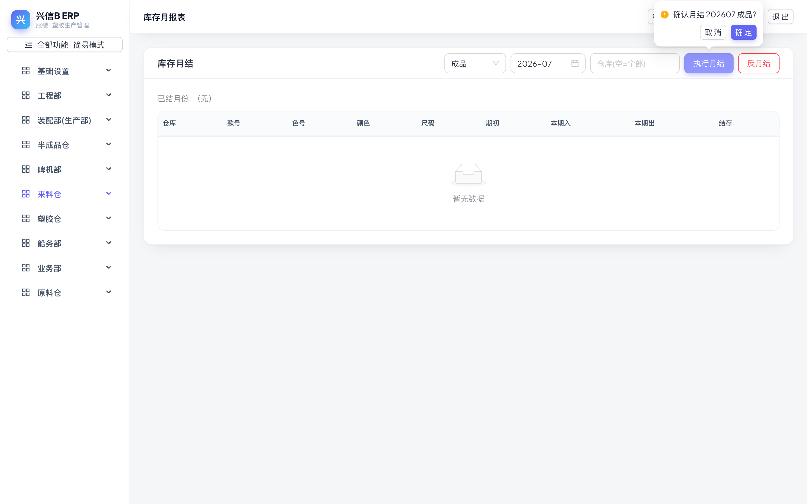

**注意点**：盘点/月结前请先截止当期单据（该审的都审掉），否则账面与实盘对不上。

---

## 第 9 章 标签与附件

### 9.1 来料标签单

1. 点击「仓库管理 → 来料标签单」，「打开」可查历史单（如 DEMO-LBL-001）。
2. 新建：明细行点「物料编号」格选物料，填数量、标签数（每行 = N 张标签），底部自动汇总 数量合计 / 标签数合计；电脑单号保存后自动生成。
3. 点「打印标签」：系统按标签数展开生成标签页并调起浏览器打印（标签数合计超过 2000 需分批）。
4. 审核后整单只读，改动先「反审核」。

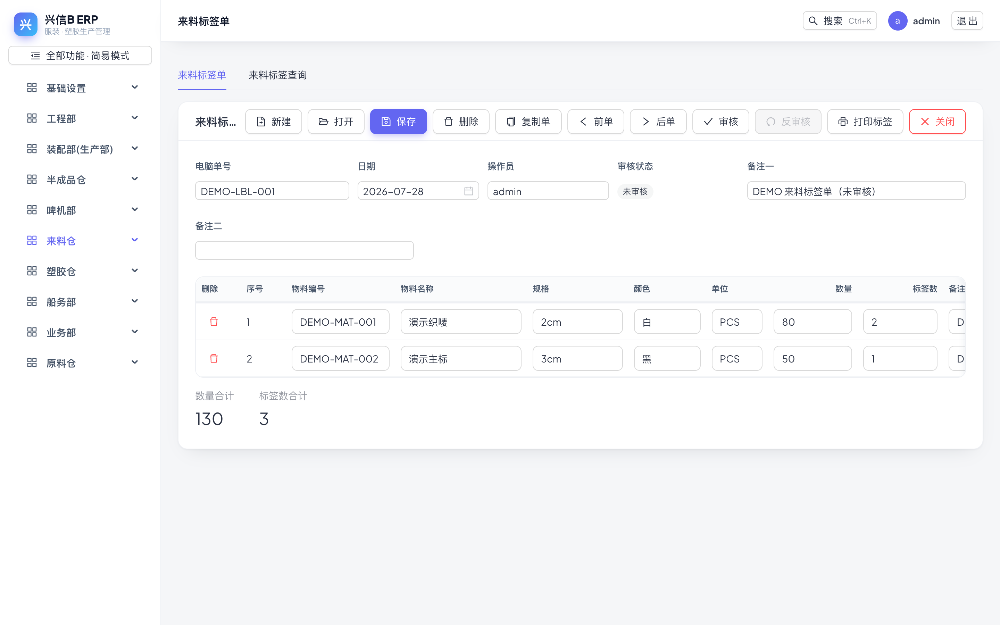

### 9.2 图片备注（附件）

1. 在 BOM 物料设置（或生产通知单）打开单据后，切到「尺寸图片备注」页签。
2. 可先填一句备注（跟随下一张图），点「上传图片」选文件（jpg/png/gif/webp/bmp，不超过 10MB）。
3. 上传后显示缩略图墙，点图可放大预览，图下有上传人、日期和「删除」。

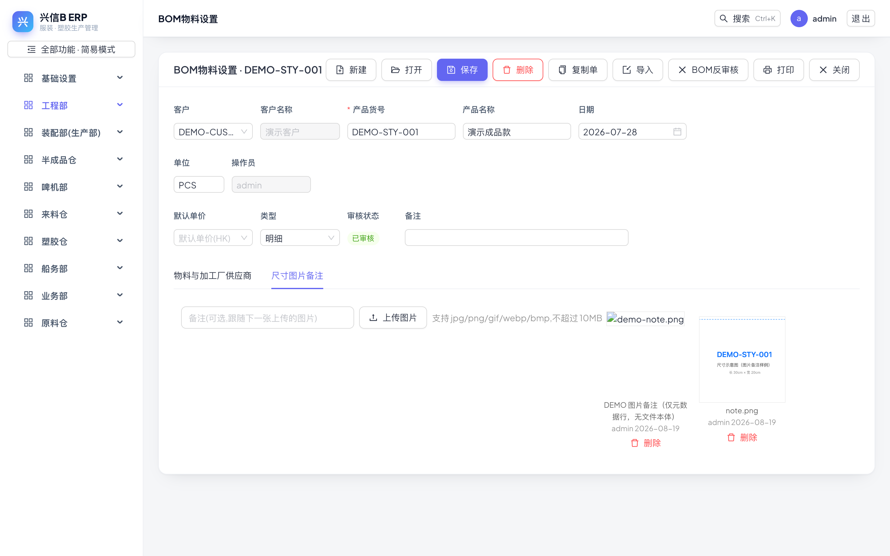

---

## 第 10 章 系统与账户

### 10.1 用户修改密码

点击「基本设置 → 用户修改密码」，输入原密码和新密码（至少 6 位）两次，点「保存」。密码连续输错 5 次账号锁定 15 分钟，到期自动解禁。


### 10.2 账号管理（管理员）

点击「基本设置 → 系统用户」：可注册新账号、重置密码、停用/启用（被锁账号可在此提前解禁）、删除账号。

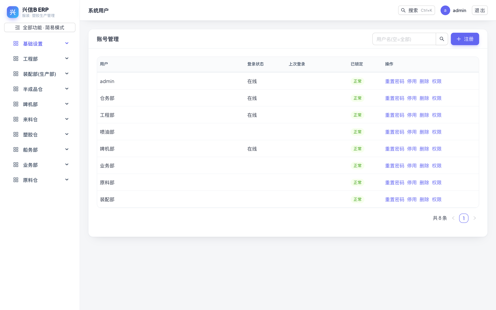

### 10.3 九位权限说明

点账号行的「权限」打开权限抽屉：按菜单逐行勾选 9 个权限位，改完点右上角「保存」。

| 权限位 | 管什么 |
|---|---|
| 打开 | 能否进入该页面/看到该菜单 |
| 保存 | 能否新增、修改（新建、编辑、注册等写操作） |
| 删除 | 能否删除记录 |
| 打印 | 能否使用打印功能 |
| 单价 | 能否看到单价/价格列（无此权限价格显示 `***`） |
| 金额 | 能否看到金额字段 |
| 审核 | 能否审核单据 |
| 反审核 | 能否反审核解锁单据 |
| 功能 | 页面级特殊功能（如备份数据的“立即备份”、账号停用/启用） |

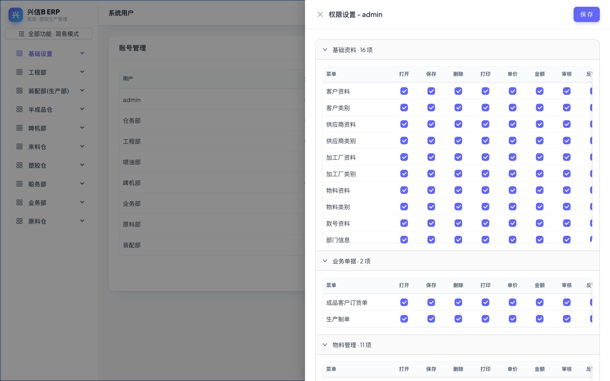

### 10.4 备份数据

点击「基本设置 → 备份数据」，点「立即备份」并确认。备份在数据库服务器上执行，文件写入服务器备份目录；备份期间请勿关机或重启数据库服务。（需要「备份数据 · 功能」权限。）

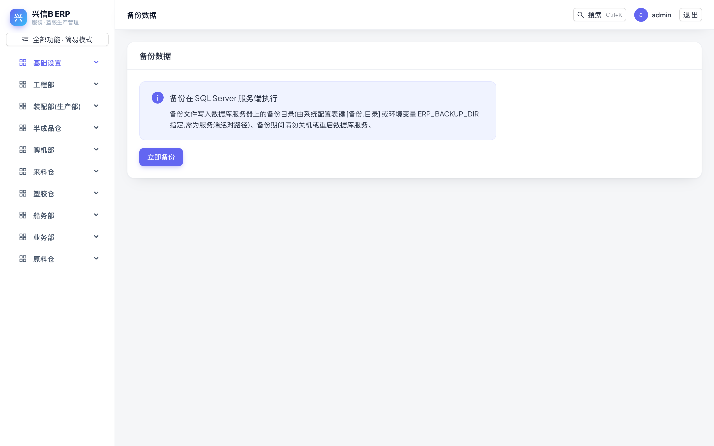

---

## 第 11 章 常见问题 FAQ

1. **「导入」按钮是灰色的？** 先在 BOM 页「打开」产品货号；单据已审核时整页只读，需先「反审核」。
2. **为什么点“编辑”却变成新建了一张单？** 单据页的「保存」在未载入旧单时等于新建。要改旧单必须先「打开」载入再保存；想改已审核的单，先「反审核」。
3. **生成采购订单时部分行被跳过？** 这些行的物料缺供应商。到「物料资料」给物料补供应商后重新勾选生成。
4. **登录提示账号被锁定？** 密码连错 5 次锁 15 分钟，可等自动解禁，或找管理员在「系统用户」停用/启用一下立即解禁。
5. **单据审核后想改？** 点「反审核」解锁 → 修改 → 保存 → 重新审核。审核中的库存影响会在反审核时回退。
6. **盘点/月结前为什么要截止单据？** 盘点按账面带出底稿、月结按账面算结存。未审核的单据不入账，会造出“账实不符”，所以先把该审的单全部审掉。
7. **报表没数据先检查什么？** ①日期范围对不对（很多报表默认本月或近一个月）；②单据**是否已审核**（未审核不进统计）；③搜索条件是不是没清空。
8. **价格列显示 `***`？** 不是数据丢了，是当前账号没有该菜单的「单价」权限，找管理员开通。
9. **入错仓（成品/半成品仓选错）？** 检查装配物料设置的「类别」字段：成品进成品仓、半成品类进半成品仓，类别没设对单据两边都会出现。
10. **改了 BOM，装配加工采购单怎么没跟着变？** 装配加工采购单保存时是 BOM 快照，不随 BOM 改动。新开的单才用新 BOM；旧单要按新 BOM 算，打开后点工具栏「辅料表」手动重建。
