# 兴信B ERP 网页版 · 操作手册（核心流程）

兴信B ERP 网页版是一套服装、塑胶一体化生产管理系统，覆盖基础资料、生产制单、采购、仓库、报表等日常业务。本手册面向一线操作员，按实际操作顺序讲解最常用的功能。

- **访问地址**：在浏览器（推荐 Chrome）中打开 `http://localhost:5173`
- **登录账号**：系统管理员会为每位操作员分配账号，例如 `admin`
- **密码安全**：密码连续输错 **5 次**，账号将被锁定 **15 分钟**，期间即使密码正确也无法登录，请谨慎输入；忘记密码请联系管理员重置

---

## 第 1 章 登录与主界面

1. 打开浏览器，输入系统地址，进入登录页。
2. 在「用户名」一栏输入账号，在「密码」一栏输入密码。
3. 点击「登 录」按钮，密码正确即进入系统主界面。
4. 主界面左侧是功能菜单，按部门分组（基础设置、工程部、装配部(生产部)、半成品仓、啤机部、来料仓、塑胶仓、船务部、业务部、原料仓）；每种单据的查询收在该单据页的第二个页签里，菜单不再单列查询入口；点击分组名可展开或收起，点击菜单项进入对应页面。

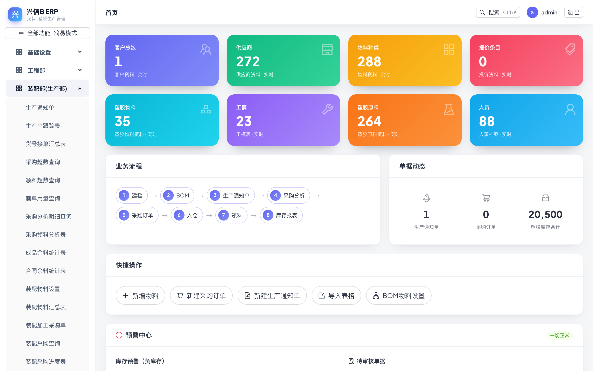

---

## 第 2 章 基础资料：物料档案与类别树

物料档案是采购、仓库、BOM 等所有环节的基础数据，建议先维护好物料再做单据。

1. 点击左侧菜单「来料仓 → 物料资料」。
2. 页面左侧是**类别树**，点选某个类别，右侧列表只显示该类别下的物料；点「全部物料」显示全部。
3. 点击类别树上方「新增同级类别」「新增子类别」可维护类别：选中一个类别后点「新增同级类别」建立与它平级的类别，点「新增子类别」在它下面建子类。
4. 点右上角「+ 新增」添加物料。物料编号可以**留空，保存时系统按类别自动生成**；也可以手工输入自己想要的编号。
5. 物料资料中的「供应商」会在后续生成采购订单时自动带出，建议一并填好。

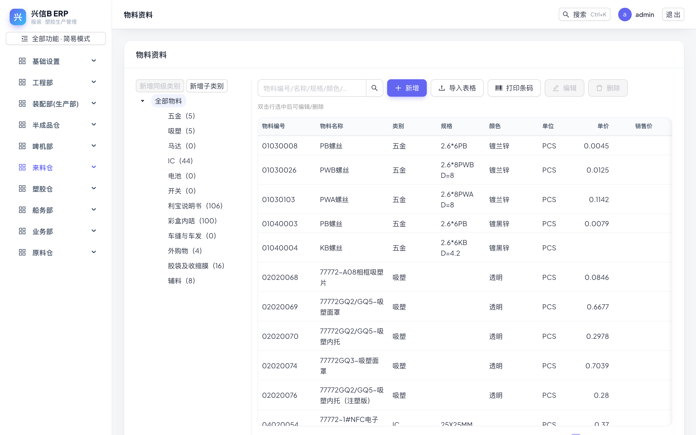

---

## 第 3 章 BOM 物料设置

BOM（物料清单）定义一个产品货号由哪些物料、半成品组成及用量，以货号 DEMO-STY-001 为例。

1. 点击左侧菜单「工程部 → BOM物料设置」。
2. 点工具栏「打开」，弹出「打开产品货号」窗口，可按货号或名称搜索。
3. 在列表中点击要查看的货号（如 DEMO-STY-001），该货号的 BOM 即载入页面。
4. 页面上方是表头（客户、产品货号、日期、单位等），下方「物料与加工厂供应商」页签是明细网格，每行一种物料，可看到物料编号、名称、规格、颜色、单位、用量等。
5. 修改明细后必须点工具栏「保存」才会写入系统；**已审核的单据处于锁定状态，须先点「反审核」解除锁定才能修改**，改完重新保存、审核。

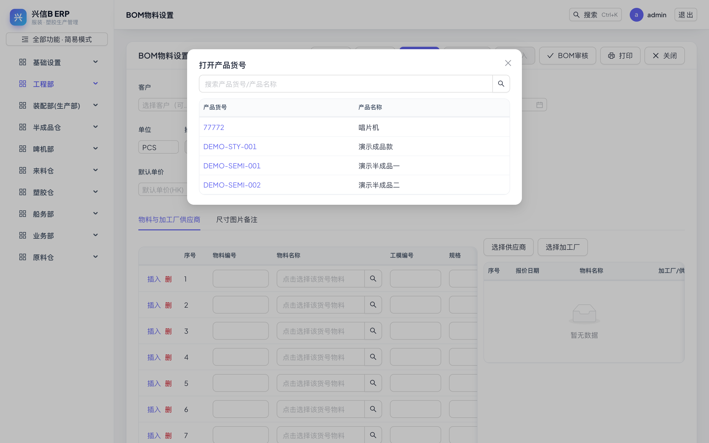

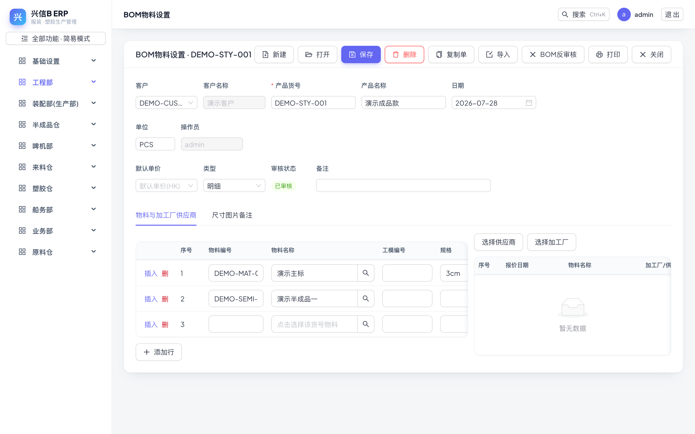

---

## 第 4 章 BOM 表格导入

明细较多时，可以从 Excel 批量导入，无需逐行录入。

1. 在 BOM 物料设置页先「打开」目标货号（导入按钮在未打开货号时是灰色不可点的）。
2. 点工具栏「导入」，弹出「导入物料明细」窗口，有两种方式：
   - **粘贴 Excel 内容**：在 Excel 里选中区域复制，直接粘贴到文本框，点「解析」；
   - **上传 CSV 文件**：选择 .csv / .txt 文件（支持 UTF-8 / GBK 编码）。**xlsx 文件请先在 Excel 里「另存为 CSV」再上传**。
3. **列规则**：
   - 有表头时按列名识别——「物料编号」**必填**（兼容写法：编号 / 料号 / 物料），「使用数量」兼容写法：用量 / 数量；另有物料名称、规格、颜色、单位等可选列；
   - 无表头时按位置识别——**第 1 列 = 物料编号，第 2 列 = 使用数量**。
4. 解析后系统**逐行对照物料档案校验**：有效行标绿色「有效」，无效行（如物料编号不存在）标红并注明原因，导入时自动跳过。
5. 窗口下方选择「追加到现有明细」或「替换全部明细」，然后点「确定导入」，有效行即进入 BOM 明细网格。
6. **注意**：导入只是把行填入网格，仍须点工具栏「保存」才真正落库；另外，**半成品款号（如 DEMO-SEMI-001）若没有在物料档案里建档，导入时同样会被判为“物料不存在”而跳过**，需先到物料资料中补建。

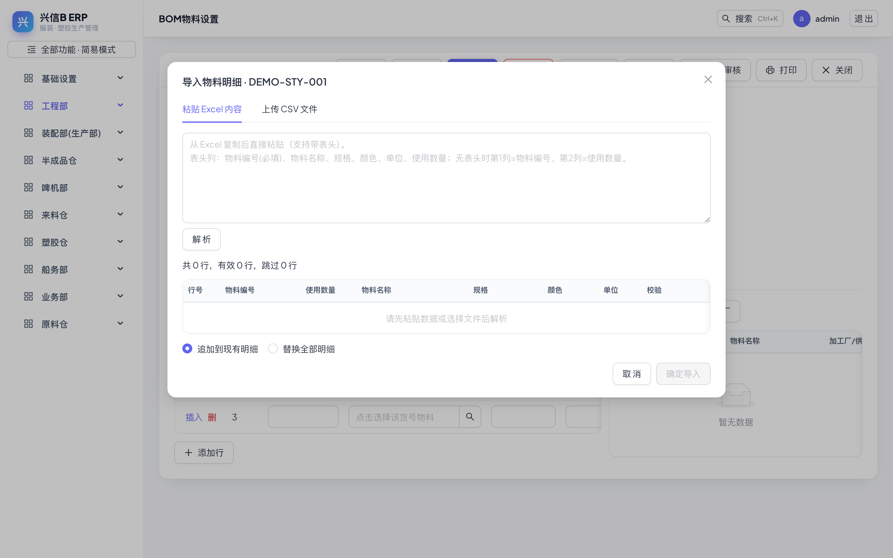

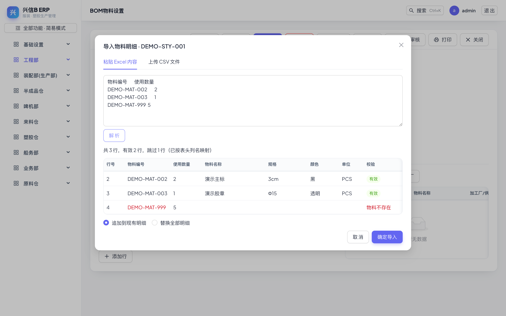

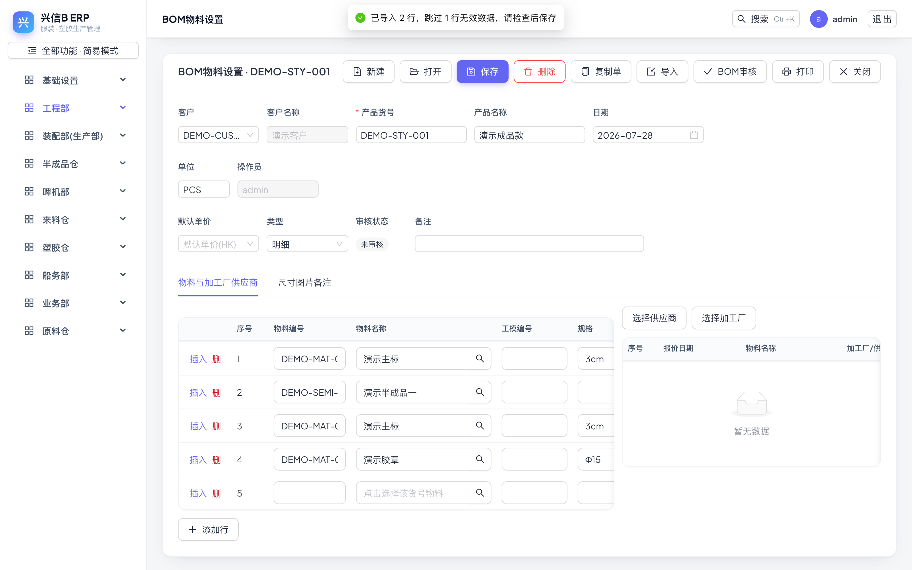

---

## 第 5 章 从采购分析到采购订单

生产单审核后，其物料需求会进入「BOM订单制作」，可在此一键生成采购订单。

1. 点击左侧菜单「来料仓 → BOM订单制作」，列表按 生产单 × 物料 列出待采购的需求行（含生产单号、款号、物料、总数量等）。
2. **勾选**要采购的物料行（可勾选多行）。
3. 点「生成采购订单」，系统弹出确认窗口，提示将生成几张订单、共几行物料。
4. 确认无误点「生成」即可；系统按 **生产单 × 供应商** 分组——同一生产单、同一供应商的物料合并为一张采购订单。
5. **缺少供应商编号的行会被跳过并提示**；物料主档里填了供应商的，系统会自动回填带出。生成后的订单可在「来料仓 → 采购订单」中查看。

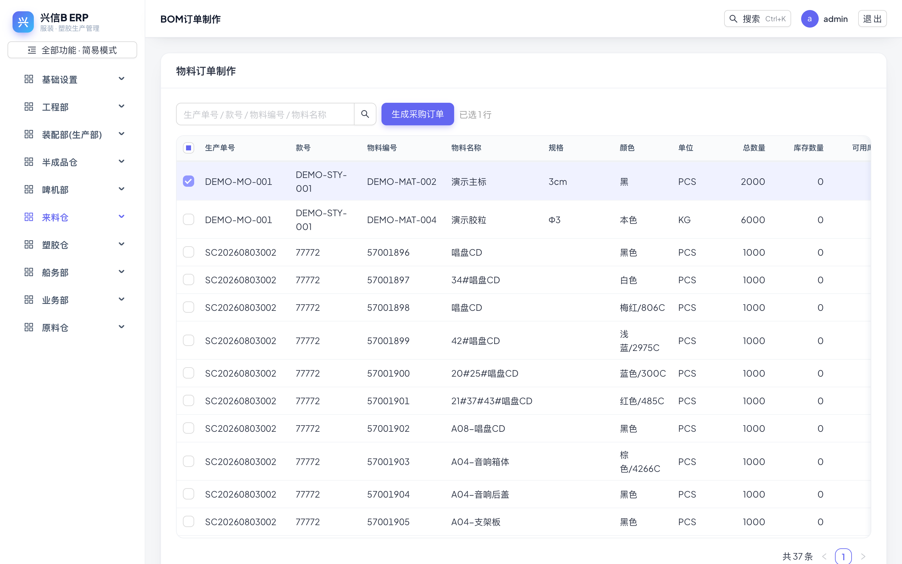

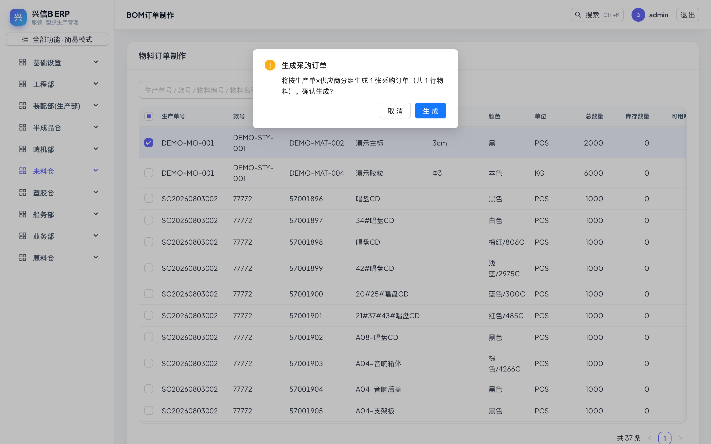

---

## 第 6 章 库存盘点

1. 点击左侧菜单「来料仓 → 库存盘点单」，列表显示所有盘点单及状态（未审核 / 已审核）。
2. 新建盘点单后，可用「带出库存」把当前账面库存带入明细，再逐行录入实盘数量。
3. 录完先点「保存」，核对无误后点「审核」。
4. **只有「已审核」的盘点单才会进入库存统计**；审核时系统按盘点结果**回写物料主档的库存数量**。
5. 审核后发现错误，可点「反审核」解除锁定再修改，改完重新审核。

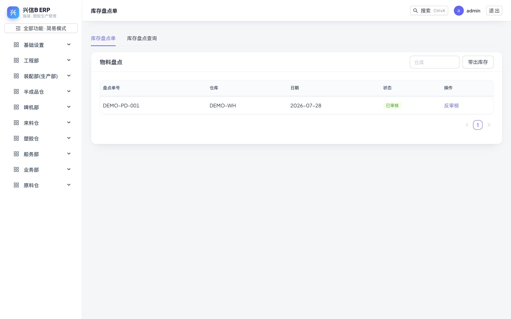

---

## 第 7 章 来料标签单

来料标签单用于登记供应商来料并打印物料标签，贴在来料包装上便于后续扫码入仓、追溯。

1. 点击左侧菜单「来料仓 → 来料标签单」。
2. 点「新建」，在明细行中录入物料编号、名称、规格、颜色、单位、数量（每行即一张标签）。
3. 底部自动汇总「数量合计」和「标签数合计」；电脑单号在保存后自动生成。
4. 点「保存」后可打印标签；已保存的单据可用「打开」「前单 / 后单」翻阅历史单据。

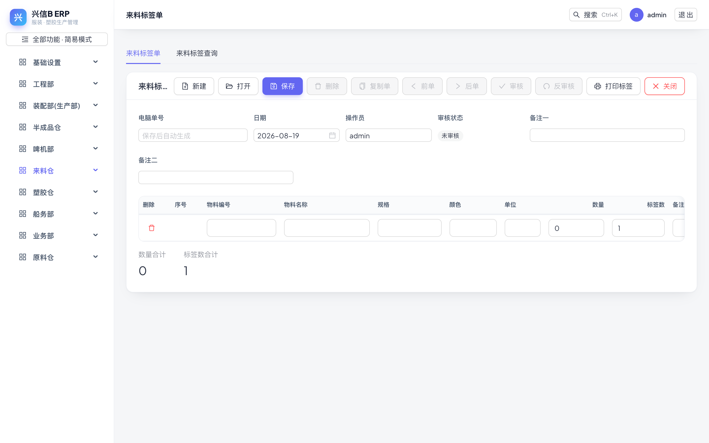

---

## 第 8 章 报表速览

「装配部(生产部)」菜单下提供 7 张常用查询报表，均支持按日期、单号、物料等条件筛选：

- **采购超数查询**：实际采购量超出需求量的物料，防止多买。
- **领料超数查询**：车间领料超出标准用量的物料，防止多领。
- **制单用量查询**：按生产单查看每种物料的标准用量。
- **采购分析明细查询**：采购需求分析的逐行明细，追溯需求来源。
- **采购领料分析表**：按生产单对照每种物料的采购需求与已领数量，差异 = 需求 − 已领（正数为欠领，负数为超领）。
- **成品余料统计表**：统计成品生产完成后的剩余物料。
- **合同余料统计表**：按合同（订单）汇总余料情况。

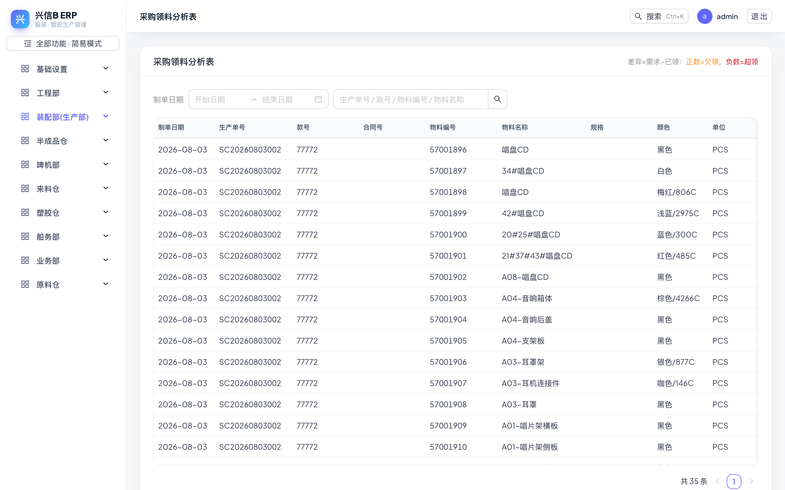

---

## 第 9 章 账户安全

1. 点击左侧菜单「基础设置 → 用户修改密码」。
2. 输入原密码，再输入新密码（**至少 6 位**）并重复确认，点「保存」即完成自助改密。
3. 密码连续输错 **5 次**账号会被锁定 **15 分钟**，到期自动解禁；着急使用请联系管理员在「系统用户」中提前解禁。
4. **自助改密与管理员重置的区别**：自助改密必须知道原密码，适合日常定期更换；忘记密码时无法自助操作，需管理员在「系统用户」中直接重置为新密码。

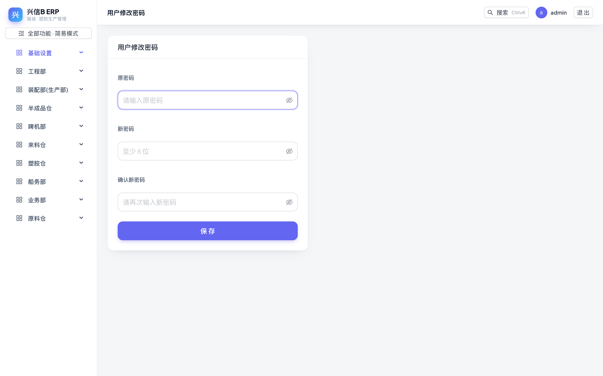

---

## 附录：常见问题 FAQ

- **「导入」按钮是灰色的点不动？**
  需先在 BOM 物料设置页「打开」一个产品货号；若该单据已审核，页面处于只读状态，须先「反审核」。
- **导入时提示“物料不存在”？**
  该编号未在物料档案中建档（半成品款号也不例外）。先到「来料仓 → 物料资料」补建，再重新导入。
- **生成采购订单时部分行被跳过？**
  这些行的物料缺少供应商。到物料资料中给物料补上供应商，系统以后会自动带出，再重新勾选生成。
- **登录提示账号被锁定？**
  密码连续输错 5 次会锁定 15 分钟，可等待到期自动解禁，或联系管理员立即解禁并重置密码。
- **xlsx 文件能直接导入吗？**
  不能。请先在 Excel 中「另存为 CSV」（UTF-8 格式最佳），再上传，或直接复制内容粘贴导入。
- **导入 / 修改后数据没生效？**
  导入和编辑都只是先填入页面网格，必须再点工具栏「保存」才会写入系统。
